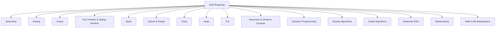

# 🚀 DSA & Advanced Algorithms in Python


> A **complete roadmap of Data Structures & Algorithms in Python**, covering everything from **fundamentals to advanced topics** — with clean code, pseudocode, explanations, and complexity analysis.

---

## 📑 Table of Contents

1. [🔍 Searching Algorithms](./Searching/README.md)
2. [⚡ Sorting Algorithms](./Sorting/README.md)
3. [📊 Array-Based Algorithms](./ArrayAlgorithms/README.md)
4. [🎯 Two Pointers & Sliding Window](./TwoPointersSlidingWindow/README.md)
5. [📦 Stack Algorithms](./StackAlgorithms/README.md)
6. [📮 Queue & Deque Algorithms](./QueueDequeAlgorithms/README.md)
7. [🌳 Tree Algorithms](./TreeAlgorithms/README.md)
8. [⛰️ Heap / Priority Queue](./HeapAlgorithms/README.md)
9. [🔡 Trie (Prefix Tree)](./Trie/README.md)
10. [♻️ Recursion & Divide & Conquer](./RecursionDivideConquer/README.md)
11. [📐 Dynamic Programming](./DynamicProgramming/README.md)
12. [💰 Greedy Algorithms](./GreedyAlgorithms/README.md)
13. [🕸️ Graph Algorithms](./GraphAlgorithms/README.md)
14. [🛠️ Advanced DSA](./AdvancedDSA/README.md)
15. [🧩 Backtracking](./Backtracking/README.md)
16. [🧮 Math & Bit Manipulation](./MathAndBitManipulation/README.md)

---

## 🛠️ What’s Inside?

✔️ **Python implementations** of all major algorithms
✔️ **Pseudocode** for each algorithm
✔️ **Time & Space complexity analysis**
✔️ **Comparison tables** to choose the best algorithm
✔️ **Structured folder system** for easy navigation
✔️ Ready-to-use for **interviews, placements, and CP contests**

---

## 🗂️ Folder Structure

```
DSA-Algorithms/
├── Searching/
├── Sorting/
├── ArrayAlgorithms/
├── TwoPointersSlidingWindow/
├── StackAlgorithms/
├── QueueDequeAlgorithms/
├── TreeAlgorithms/
├── HeapAlgorithms/
├── Trie/
├── RecursionDivideConquer/
├── DynamicProgramming/
├── GreedyAlgorithms/
├── GraphAlgorithms/
├── AdvancedDSA/
├── Backtracking/
├── MathAndBitManipulation/
└── README.md
```

---

## 📊 Visual Roadmap



---

## 🎯 Goal

📌 Make **DSA revision simple & structured**
📌 Help students crack **interviews & competitive programming**
📌 Build one of the **most-starred DSA repos** on GitHub 🚀

---

## 🤝 Contribution

Want to improve this repo? Contributions are welcome!

* Fork the repo
* Create a new branch
* Add your changes
* Submit a Pull Request 🎉

---

## 📜 License

This project is licensed under the **MIT License** – free to use, modify, and distribute with attribution.

---

✨ If you find this helpful, don’t forget to **star ⭐ the repo** and share it with others!

---
